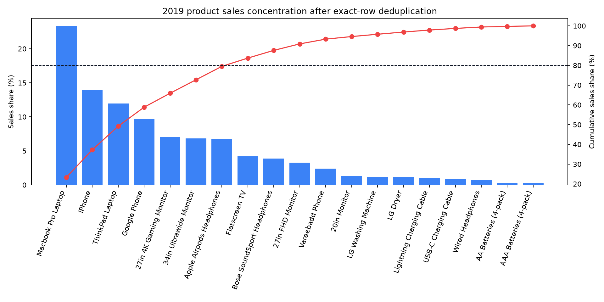

# 2019 电子产品销售数据：从教程复现到自主探究

这是对 Keith Galli 的 [Pandas Data Science Tasks](https://github.com/KeithGalli/Pandas-Data-Science-Tasks)
所做的独立学习扩展。原教程回答了月份、城市、广告时段、共同购买和畅销商品等问题；本项目进一步检查数据质量，
并把分析推进到商品组合、需求波动、示例性库存决策和城市贡献来源。

> 分析代码在 [`analysis.py`](analysis.py)，完整中文报告在
> [`REPORT.zh-CN.md`](REPORT.zh-CN.md)，可复用结果表在 [`outputs`](outputs)，图表在
> [`figures`](figures)。

## 核心发现

- 原始有效记录 185,950 行，其中严格属于 2019 年的记录为 185,916 行。
- 发现 264 条多余的完全重复记录，涉及 264 个订单；若不处理，会多计 267 件商品和
  **$26,498.03** 销售额，占原销售额的 **0.0768%**。
- 去重并限定 2019 年后保留 185,652 行，销售额由 $34,483,365.68 修正为
  **$34,456,867.65**；不同订单数保持 178,406，说明被删的是重复副本。
- Macbook Pro Laptop 的清洗后销售额最高，为 **$8,030,800**，占总销售额 **23.31%**。
- 前 5 种商品贡献 **65.87%** 销售额；需要 8 种商品才能达到至少 80%（第 8 种后累计
  83.70%）。
- 重复记录造成的绝对虚增额以 Macbook Pro Laptop 最高（$5,100）；相对虚增比例以
  Lightning Charging Cable 最高（0.2068%）。
- iPhone 与 27in 4K Gaming Monitor 均属于“高价高销量”商品，周销量 CV 分别为
  28.95% 和 29.57%。
- San Francisco (CA) 是这两种重点商品销售额最高的城市，占各自销售额的 24.24% 和
  23.37%；城市领先主要来自订单数量，而不是每单购买更多。



## 一键复现

在仓库根目录执行：

```bash
python -m pip install -r extended_analysis/requirements.txt
python extended_analysis/analysis.py
```

脚本读取 `SalesAnalysis/Sales_Data` 下的 12 个月 CSV，自动创建/更新 `outputs` 和
`figures`。Matplotlib 使用非交互式 `Agg` 后端，运行时不会弹出需要手动关闭的窗口。

## 方法边界

库存部分使用历史销量和假设的两周提前期，目的是演示如何比较三种补货点估计法。数据集中没有实际库存、缺货、
提前期、成本、毛利、促销或获客成本，因此这些数值不能直接作为采购指令。销售额也不等于利润。

本扩展在学习过程中借助 AI 进行提问、代码审阅与表达整理；所有数字均可由仓库内脚本和原始数据复现。

## 数据质量反馈

完全重复记录的发现已经反馈给原仓库：
[Issue #23: Potential exact duplicate transaction rows in Sales_Data](https://github.com/KeithGalli/Pandas-Data-Science-Tasks/issues/23)。

## Attribution

The dataset and original tutorial repository are by Keith Galli and retain their original license and attribution.
This directory contains the independent extension and interpretation created for this learning project.
