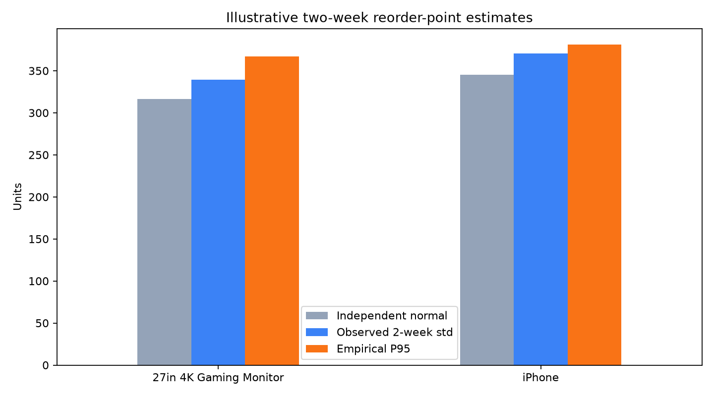

# 2019 电子产品销售数据自主探究报告

## 1. 研究目的

原教程以 Pandas 完成五个典型业务问题。复现这些问题之后，本项目继续追问：基础数据是否可靠；不同商品如何共同贡献销售额；
高价值商品的需求是否稳定；按历史需求估算补货点会受到哪些假设影响；重点城市的领先究竟来自订单量还是每单购买量。

因此，这份报告既记录结论，也保留分析口径、验证步骤和不能由数据支持的部分。

## 2. 数据范围与清洗口径

读取 `SalesAnalysis/Sales_Data` 中 12 个月的 CSV 后，先删除空行和重复表头，再把数量、单价和日期转换为正确类型。
日期范围严格限定为 2019 年，避免把跨年记录混入年度指标。

随后以所有原始字段为键识别完全重复行。一个重复组保留第一条，其余视作多余副本。结果如下：

| 指标 | 结果 |
|---|---:|
| 原始有效记录 | 185,950 |
| 严格 2019 年记录 | 185,916 |
| 参与重复的记录 | 528 |
| 多余重复副本 | 264 |
| 涉及订单数 | 264 |
| 被重复计算的销量 | 267 |
| 被重复计算的销售额 | $26,498.03 |
| 虚增销售额比例 | 0.0768% |
| 清洗后记录 | 185,652 |

去重前后不同订单数都为 178,406。这个核对很关键：它说明删除操作没有删掉独立订单，只删掉了成对出现的副本。

数据质量问题金额占比不大，但它会系统性抬高销量和销售额。更重要的是，如果没有先做审计，后续每一张漂亮图都可能只是把错误画得更漂亮。

## 3. 商品销售组合

清洗后总销售额为 **$34,456,867.65**。Macbook Pro Laptop 以 **$8,030,800** 位居第一，
贡献 **23.31%**。前 5 种商品累计贡献 **65.87%**；达到至少 80% 需要 8 种商品，累计占比为 83.70%。

这说明销售额具有明显集中性，但并没有集中到“只靠一两种商品就能过日子”的程度。经营上既要保护头部商品，也要避免把所有鸡蛋、充电线和 MacBook 都塞进同一个篮子。

重复数据对商品的影响有两个排名口径：

- 绝对虚增额最高：Macbook Pro Laptop，$5,100；
- 相对虚增比例最高：Lightning Charging Cable，0.2068%。

两种排名不同并不矛盾。高单价商品少量重复就会造成较大金额，低价高销量商品则可能在自身销售额中形成更高比例。

## 4. 商品角色与经营解释

按商品单价中位数和销量中位数将商品分成四类。iPhone 与 27in 4K Gaming Monitor 落在“高价高销量”象限，
适合作为重点观察对象。高价低销量商品虽然贡献了较多销售额，但“提高销量就一定更赚钱”无法由当前数据证明：销售额不是利润，
还需要商品成本、折扣、退货、获客成本和供给约束。

更严谨的经营表达是：在不显著降低价格、不过度增加获客成本且供应允许的前提下，高价高销量商品的销量增长可能带来较大的增量销售额；
真正的利润判断仍需补充成本数据。

## 5. 周需求与示例性库存分析

将清洗后的日销量汇总为周销量，并为没有销量的周补零：

| 商品 | 周均销量 | 周标准差 | 周销量 CV | 峰值/均值 | 周极差 |
|---|---:|---:|---:|---:|---:|
| 27in 4K Gaming Monitor | 117.70 | 34.80 | 29.57% | 1.72 | 161 |
| iPhone | 129.15 | 37.39 | 28.95% | 1.78 | 179 |

CV 是标准差除以均值，用于比较不同销量水平商品的相对波动。两者 CV 接近，iPhone 略低；但峰均比和极差显示 iPhone 的绝对峰值更高。

在假设提前期为两周、目标服务水平约 95% 的条件下，比较三种补货点估计：

| 商品 | 独立正态公式 | 考虑相关性 | 历史两周需求 P95 | 历史覆盖率：公式 / 调整 / P95 |
|---|---:|---:|---:|---:|
| 27in 4K Gaming Monitor | 316.36 | 339.12 | 367.20 | 86.54% / 92.31% / 94.23% |
| iPhone | 345.29 | 370.44 | 380.90 | 90.38% / 94.23% / 94.23% |

原始公式覆盖率偏低，是因为它假设相邻周独立且需求形状足够接近正态。实际数据中，两种商品的一阶自相关约为 0.65 和 0.67，
实际两周需求标准差约为独立假设值的 1.25 倍。加入相关性后覆盖率改善；经验 P95 最接近目标，但 52 个重叠窗口仍是有限样本，
而且同一批历史数据被同时用于估计和检验，结果可能偏乐观。

这些数字是方法演示，不是采购建议。真正制定库存策略还需要采购提前期及其波动、现有库存、缺货损失、持有成本、最小订货量和季节性预测。

## 6. 城市贡献来源

两种重点商品销售额最高的城市都是 San Francisco (CA)：

| 商品 | 订单数 | 销量 | 销售额 | 每单销售额 | 商品内销售额占比 |
|---|---:|---:|---:|---:|---:|
| 27in 4K Gaming Monitor | 1,454 | 1,458 | $568,605.42 | $391.06 | 23.37% |
| iPhone | 1,658 | 1,659 | $1,161,300.00 | $700.42 | 24.24% |

两者的前三城市顺序相同：San Francisco、Los Angeles、New York City。San Francisco 的商品内订单占比与销售额占比几乎一致，
每单件数指数约为 100。因此它的领先主要来自更多订单，而不是顾客每笔订单购买更多。若要解释“为什么订单更多”，还需要人口、收入、门店覆盖、
渠道投入、价格与促销曝光等外部数据。

## 7. 结论与下一步

本项目从教程复现走到了分析审计：先验证数据，再定义指标，最后把结论与证据边界一起交付。自主发现的完全重复记录已经通过
[上游 Issue #23](https://github.com/KeithGalli/Pandas-Data-Science-Tasks/issues/23) 反馈给原作者。

下一步可增加以下工作：

1. 将数据质量检查封装成自动化测试，在原始 CSV 更新时立即报警；
2. 使用留出期或滚动回测比较库存方法，避免在同一批数据上估计和评估；
3. 加入成本、毛利、促销、缺货和提前期数据，把销售额分析升级为利润和库存决策；
4. 引入城市外部特征，检验订单量差异的真实驱动因素。
